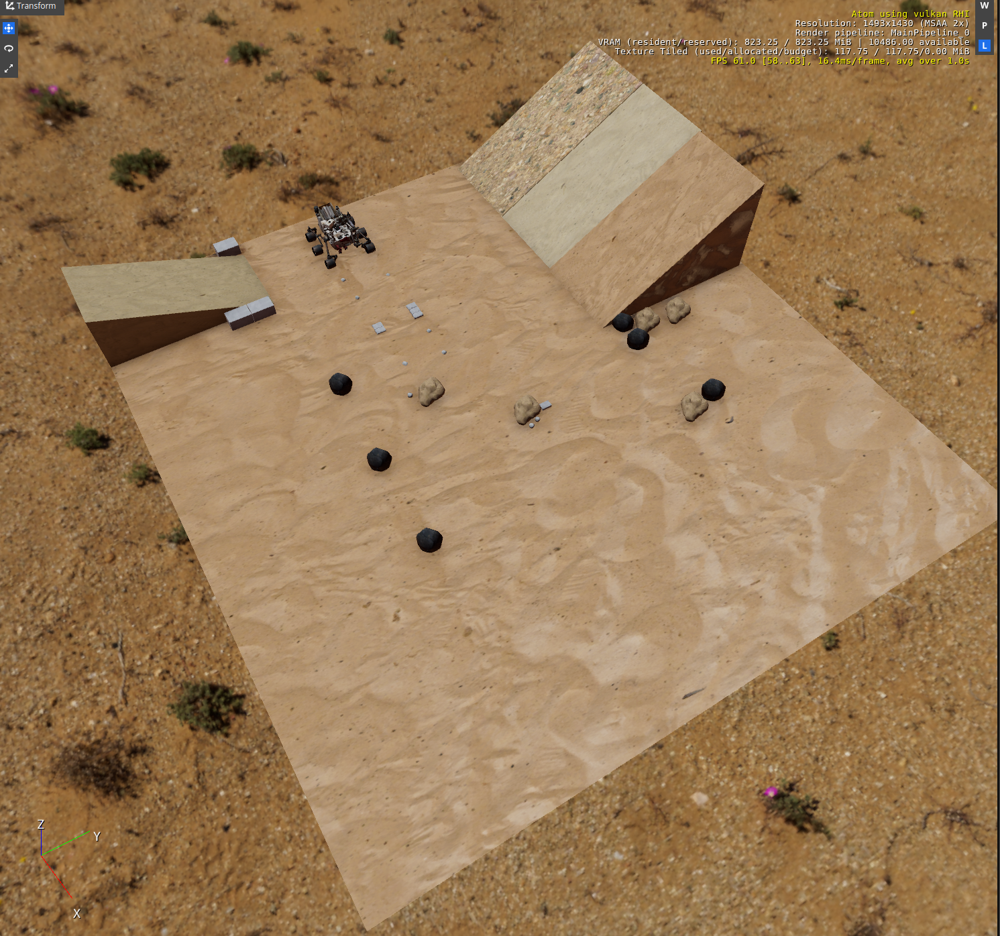

[![Apache License, Version 2.0][apache_shield]][apache]

# Mars Yard Gem

Author: Azmyin Md. Kamal
Date: 09/09/2024
Version: 1.0

This is the Mars Yard gem, an Asset only gem based on NASA JPL's [Mars Yard](https://www-robotics.jpl.nasa.gov/how-we-do-it/facilities/marsyard-iii/) rover testing fascility. It was created as part of submission for the NASA Space ROS Sim Summer Sprint Challenge 2024, Issue [#181](https://github.com/space-ros/docker/issues/181).  

## Installation

**TODO** Commands to register with O3DE engine


## Description

**TODO** update descriptions here. Mention it was created as part of the NASA Space ROS Sim and will be later incorporated as part of my O3DE RSL library.

**TODO** two liner description based on Mars Yard

```sample
The warehouse consists of two rooms and some space outside of the building. Please note, that the whole asset is scaled down, i.e., the dimensions of the building are relatively small for most applications.
```

**TODO** very briefly describe what assest are here and mention what PhysX stuff needs to be applied.


## Screenshots

<p align="left">
  
</p>


## Acknowledgments
This work is licensed under [Apache License, Version 2.0][apache]. You may elect at your option to use the [MIT License][mit] instead. Contributions must be made under both licenses.

[apache]: https://opensource.org/licenses/Apache-2.0
[mit]: https://opensource.org/licenses/MIT
[apache_shield]: https://img.shields.io/badge/License-Apache_2.0-blue.svg