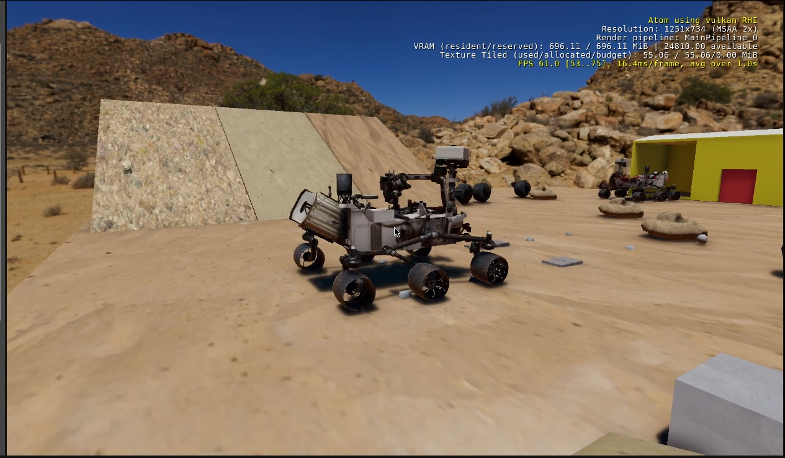

[![Apache License, Version 2.0][apache_shield]][apache]

# Mars Yard Gem

Author: Azmyin Md. Kamal
Date: 09/09/2024
Version: 1.0

This is the Mars Yard gem, an Asset only gem based on NASA JPL's [Mars Yard](https://www-robotics.jpl.nasa.gov/how-we-do-it/facilities/marsyard-iii/) rover testing fascility. It was created as part of submission for the NASA Space ROS Sim Summer Sprint Challenge 2024, Issue [#181](https://github.com/space-ros/docker/issues/181). Comes with a number of custom prefabs and phyxmaterials.

## Installation

Follow the Docker installation instruction in [o3de_nasa_rover](https://github.com/Mechazo11/o3de_nasa_rover) repository for a guide on how to install this asset gem into 

## Screenshots

  

## Acknowledgments
This work is licensed under [Apache License, Version 2.0][apache]. You may elect at your option to use the [MIT License][mit] instead. Contributions must be made under both licenses.

[apache]: https://opensource.org/licenses/Apache-2.0
[mit]: https://opensource.org/licenses/MIT
[apache_shield]: https://img.shields.io/badge/License-Apache_2.0-blue.svg